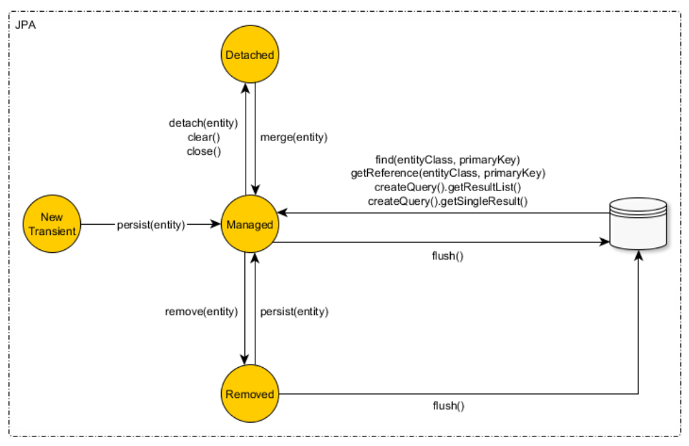

## JPA jpa springboot jpa使用 entity relationship mapping onetoone onetomany manytoone manytomany usage:
## 搞清楚几个概念：
### 外键：引用别的表的键的键，比如轮胎引用车子，那么轮胎表里面的car_id字段就叫做外键。

### 维护关联关系方： 这个是JPA Entity 对象的概念，表示该Entity负责维护与其他Entity的关系。有外键的表的Entity就是关系维护方，而且另一方必须配置mappedBy。

### @OneToOne @OneToMany @ManyToOne @ManyToMany 表示的是所在的当前的Entity对象与标注的属性对象的关系，例如：
```java
public class Car {
    ......
    @OneToMany
    private List<Wheel> wheels;
}
```

### @ManyToMany 代表多对多的关联关系、这种关联关系任何一方都可以维护关联关系。一般ManyToMany会用@JoinTable注解创建一张中间表，
### 并且添加了两个设定的外键个中间表， 或者使用成对的@ManyToOne 和 @OneToMany代替，因为我们的中间表可能还有一些约定的公共字段，
### 如 ID,update_time,create_time等其他字段。
```java

@Entity
public class User {
    @Id
    @GeneratedValue(strategy = GenerationType.IDENTITY)
    private Long id;
    
    private String name;
    
    @ManyToMany(fetch = FetchType.EAGER)
    @JoinTable(
        name = "user_roles", //中间表名称
        joinColumns = @JoinColumn(name = "user_id"), //维护关联关系一方的外键字段的名字
        inverseJoinColumns = @JoinColumn(name = "role_id") //另一方表的外键字段的名字
    )
    private Set<Role> roles;
}

@Entity
public class Role {
    @Id
    @GeneratedValue(strategy = GenerationType.IDENTITY)
    private Long id;

    private String name;
    
    /*
    mappedBy的值是指另一方的实体里面属性的字段，而不是数据库字段，也不是实体的对象
    的名字。也就是维护关联关系的一方属性字段名称，或者加了@JoinColumn 或 @JoinTable
    注解的属性字段名称。这里是class User的Set<Role> roles属性的属性名称：roles
     */
    @ManyToMany(mappedBy = "roles") 
    private Set<User> users;
    
}

```
### cascade 级联：
一般是多对一和多对多的时候不使用级联，一对一和一对多可以使用级联，这两种情况使用级联比较多，总结来说，这个对象归你控制，
你就能够级联，它不归你一个人所有，那你就不要级联。
default CascadeType is none. This means that no operations are cascaded by default.

cascade: CascadeType[] cascade() default {};
CascadeType.PERSIST 级联新建
CascadeType.REMOVE 级联删除
CascadeType.PEFRESH 级联刷新
CascadeType.MERGE 级联更新
CascadeType.ALL 四项全选

orphanRemoval表示当关联关系被删除的时候，是否应用级联删除。 默认为 false。

orphanRemoval 和 CascadeType.REMOVE的区别
CascadeType.REMOVE 级联删除，先删除user表的数据，再删除user_info表的数据。  （因为存在外键关联，无法先删除user_info表的数据）
orphanRemoval = true 先将user_info表中的数据外键user_id 更新为 null，然后删除user_info表的数据,再删除user表的数据。

### 特点：
@ManyToOne 一定是维护外键关系的一方，所以没有mappedBy字段;
@ManyToOne 删除的时候一定不能把One的一方删除了，所以也没有orphanRemoval选项;
@ManyToOne 的Lazy效果和 @OneToOne 的一样，所以和上面的用法基本一致；
@OneToMany 的Lazy是有效果的;

### JPA Hibernate status flow: 



------------------------------------------------------------------------------------------------------------
以下是Spring Boot中JPA（Java Persistence API）的一些常用注解：

1. @Entity

• 用于标识一个类为JPA实体类，表示这个类可以被映射到数据库中的一张表。例如：
@Entity
public class Book {
// 类的成员变量和方法
}
2. @Id

• 标注在实体类的成员变量上，表示该变量是实体类的主键。例如：
@Entity
public class User {
@Id
private Long id;
// 其他成员变量和方法
}
3. @GeneratedValue

• 与@Id注解一起使用，用于指定主键的生成策略。常见的策略有IDENTITY（适用于MySQL等数据库）、SEQUENCE（适用于Oracle等数据库）、TABLE和AUTO。例如：
@Entity
public class Product {
@Id
@GeneratedValue(strategy = GenerationType.IDENTITY)
private Long id;
// 其他成员变量和方法
}
4. @Table

• 用于指定实体类对应的表名，如果不使用这个注解，默认表名是实体类的类名（首字母小写）。例如：
@Entity
@Table(name = "my_product_table")
public class Product {
@Id
@GeneratedValue(strategy = GenerationType.IDENTITY)
private Long id;
// 其他成员变量和方法
}
5. @Column

• 标注在实体类的成员变量上，用于指定该变量对应表中的列名、列的长度、是否可为空等属性。例如：
@Entity
public class Employee {
@Id
@GeneratedValue(strategy = GenerationType.IDENTITY)
private Long id;

    @Column(name = "employee_name", length = 50, nullable = false)
    private String name;
    // 其他成员变量和方法
}

---
#### 关联关系：

[juejin.cn-Spring Data JPA Entity之间的关联关系注解如何正确使用.pdf](juejin.cn-Spring%20Data%20JPA%20Entity%3F%3F%3F%3F%3F%3F%3F%3F%3F%3F%3F%3F%3F%3F%3F.pdf)

** 在JPA协议中也是明确规定：维护关联关系的是拥有外键的一方, 而另一方必须配置mappedBy.
** 所以一对多映射关系中，多的那一方(从表)就是拥有外键的一方，也就是维护关联关系的一方。而一的那一方(主表)才需要在字段上配置mappedBy.
** 例如：1个用户 : N个地址
```java
public class Address {
    @Id
    @GeneratedValue(strategy = GenerationType.AUTO)
    private Long id;
    private String address;
    @ManyToOne(cascade = CascadeType.ALL)
    private User user;
}

public class User {
    @Id
    @GeneratedValue(strategy = GenerationType.IDENTITY)
    @Column(name = "id")
    private Integer id;
    private String name;
    private String email;
    private String sex;
    @OneToMany(mappedBy = "user", fetch = FetchType.LAZY)
    private List<Address> address;
} 
```


6. @OneToOne、@OneToMany、@ManyToOne、@ManyToMany

• 这些是用于定义实体类之间关系的注解。

• @OneToOne：表示一对一关系，例如一个用户对应一个用户详情。
它可以放在field上面，也可以放在get/set方法上面。 其中JPA协议有规定，如果配置双向关联，维护关联关系的是拥有外键的一方，
而另一方必须配置mappedBy;如果是单项关联，直接配置在拥有外键的一方即可。
单向关联关系例子：

```java
@Data
@Entity
@NoArgsConstructor
@AllArgsConstructor
@Builder
public class User {
    @Id
    @GeneratedValue(strategy = GenerationType.IDENTITY)
    private Integer id;
    private String name;
    private String email;
    private String sex;
    private String address;
}

@Entity
@Data
@Builder
@AllArgsConstructor
@NoArgsConstructor
@ToString(exclude = "user")
public class UserInfo {
    @Id
    @GeneratedValue(strategy = GenerationType.AUTO)
    private Integer id;
    private Integer ages;
    private String telephone;
    @OneToOne
    private User user;
}
```
双向关联关系例子：
```java


@Data
@Entity
@NoArgsConstructor
@AllArgsConstructor
@Builder
public class User {
    @Id
    @GeneratedValue(strategy = GenerationType.IDENTITY)
    @Column(name = "id")
    private Integer id;
    private String name;
    private String email;
    private String sex;
    private String address;
    @OneToOne(mappedBy = "user") 
    /*
    mappedBy：关联关系维护方(UserInfo)对象里面的被维护方(User)的属性名字, 双向关联的时候必填。
    mappedBy后只有关联关系的维护方才能操作两个实体之间外键的关系。被维护方即使设置维护方属性进行存储也不会更新外键关联。
    mappedBy不能与@JoinColumn或者@JoinTable同时使用，因为没有任何意义，关联关系不在这里面维护。
    mappedBy的值是指另一方的实体里面属性的字段，而不是数据库字段，也不是实体的对象的名字。
    也就是维护关联关系的一方属性字段名称，或者加了@JoinColumn 或 @JoinTable注解的属性字段名称。
    如上面的User例子user里面的mappedBy的值，就是userinfo里面的user字段的名字。
    */
    private UserInfo userInfo;
}

@Entity
@Data
@Builder
@AllArgsConstructor
@NoArgsConstructor
@ToString(exclude = "user")
public class UserInfo {
    @Id
    @GeneratedValue(strategy = GenerationType.AUTO)
    private Integer id;
    private Integer ages;
    private String telephone;
    @OneToOne
    private User user;
}
```


• @OneToMany：表示一对多关系，例如一个部门有多个员工。

• @ManyToOne：表示多对一关系，例如多个订单对应一个客户。

• @ManyToMany：表示多对多关系，例如一个学生可以选择多门课程，一门课程可以被多个学生选择。
@ManyToMany代表多对多的关联关系、这种关联关系任何一方都可以维护关联关系。
这种方法实不可取，当用到@ManyToMany的时候一定是三张表,不要想着建两张表,两张表肯定是违背表的原则
改进方法：
    - 创建中间表, 通过@JoinTable注解创建一张中间表，并且添加了两个设定的外键.
    - 或者：利用@ManyToOne 和 @OneToMany 表达多对多的关联关系

7. @JoinColumn

• 在@OneToOne、@OneToMany、@ManyToOne关系中，用于指定外键列的名称等属性。例如：
@Entity
public class Order {
@Id
@GeneratedValue(strategy = GenerationType.IDENTITY)
private Long id;

    @ManyToOne
    @JoinColumn(name = "customer_id") //JoinColumn name就是外键列名, 即Order表的cusomter_id外键
    private Customer customer; //一个客户有多个订单，Customer 1 : N Order
    // 其他成员变量和方法
}


8. @Transient

• 标注在实体类的成员变量上，表示该变量不需要被持久化到数据库中，例如一些临时计算的变量。
@Entity
public class Sale {
@Id
@GeneratedValue(strategy = GenerationType.IDENTITY)
private Long id;

    private double price;
    private int quantity;

    @Transient
    private double total;
    // 其他成员变量和方法
}


---


---